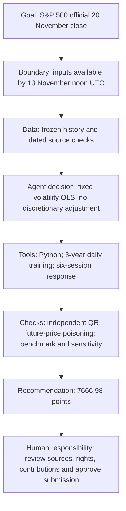

# Labelled workflow

```mermaid
flowchart TD
 G[Goal: S&P 500 official 20 November close] --> B[Boundary: inputs available by 13 November noon UTC]
 B --> D[Data: frozen history and dated source checks]
 D --> A[Agent decision: fixed volatility OLS; no discretionary adjustment]
 A --> T[Tools: Python; 3-year daily training; six-session response]
 T --> C[Checks: independent QR; future-price poisoning; benchmark and sensitivity]
 C --> F[Recommendation: 7666.98 points]
 F --> H[Human responsibility: review sources, rights, contributions and approve submission]
```

The numerical run used the earlier actual cutoff 11:45:32 UTC. The package reproduction reads saved aggregates; it does not call a live data or AI service.
